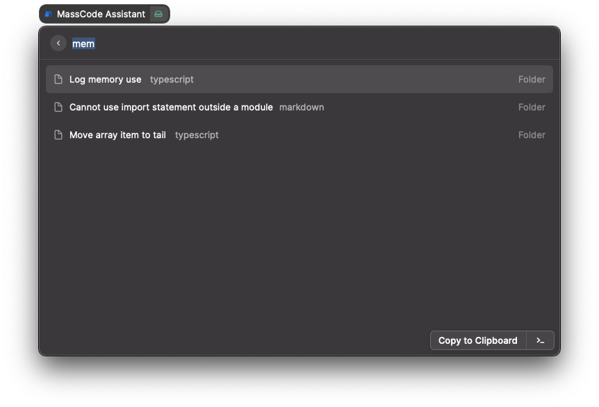

# massCode Assistant for Raycast

Fetch snippets from [massCode](https://github.com/massCodeIO/massCode), search and copy to clipboard.



## Manual install to Raycast

```bash
npm i && npm run dev
```

After executing the command, you can stop development mode. The extension will be installed.